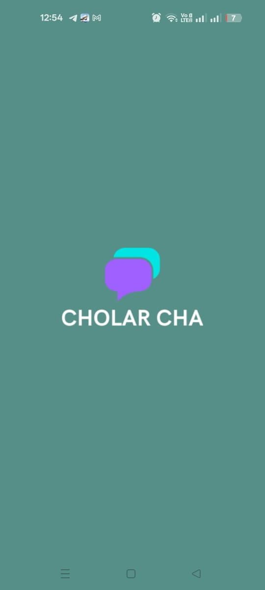
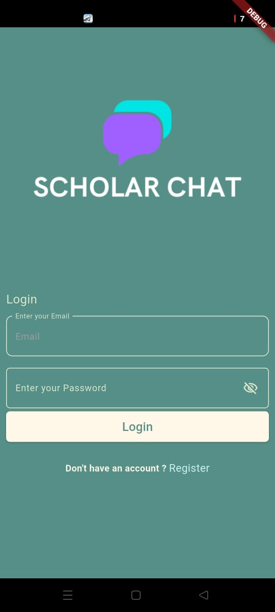
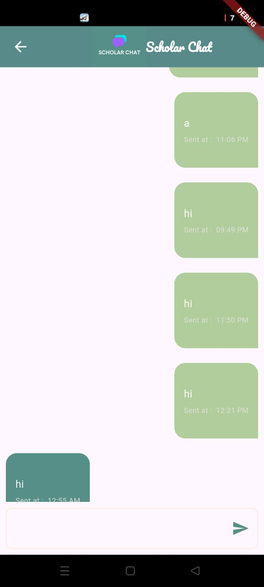

# 💬 Scolar Chat App

A **Flutter Chat Application** built with **Firebase** for authentication and real-time messaging.  
The app follows **Clean Architecture principles** to ensure scalability, maintainability, and clean code structure.  

---

## 🚀 Features
- 🔑 **Authentication** with Firebase:
  - Register new users
  - Login existing users
- 💬 **Real-time Chat** using Firebase Firestore
- 🏛️ **Clean Architecture** applied for better structure and maintainability
- 📱 Simple UI with three main pages:
  - **Login Page**
  - **Register Page**
  - **Chat Page**

---

## 🛠️ Tech Stack
- **Flutter** & **Dart**
- **Firebase Authentication** (Login & Register)
- **Firebase Firestore** (Chat data storage)
- **Clean Architecture**

---

## 📷 Screenshots

| Splash Page | Login Page | Chat Page |
|-------------|------------|-----------|
|  |  |  |

---

## ⚡ Getting Started

### 1️⃣ Clone the repository
```bash
git clone https://github.com/your-username/scolar_chat_app.git
cd scolar_chat_app
